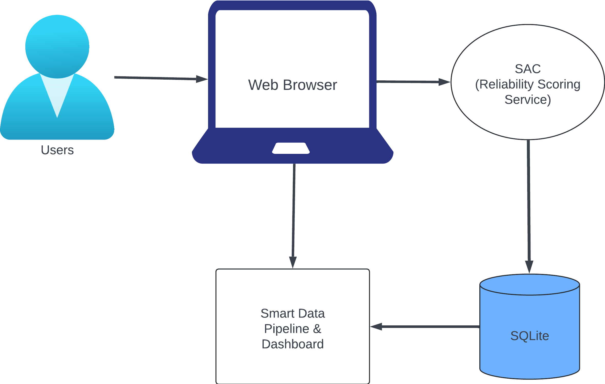
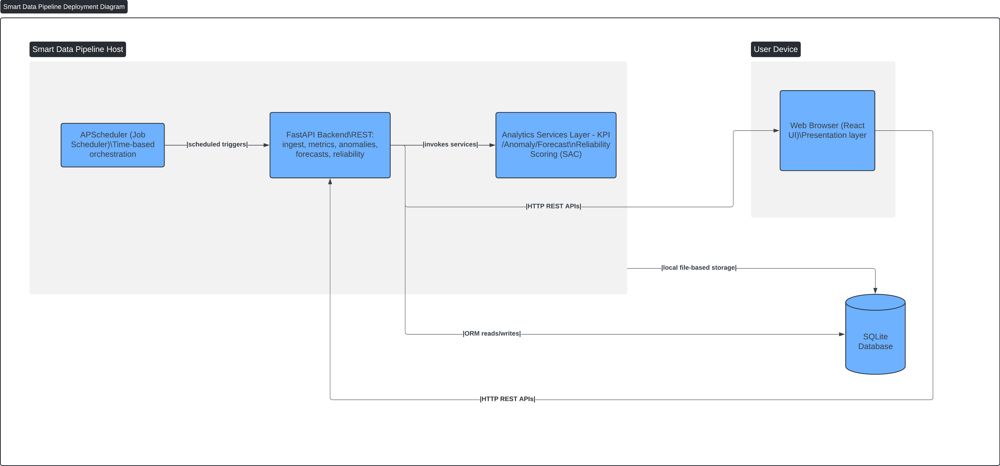

# Smart Data Pipeline – Architecture Documentation

## 1. Overview

The Smart Data Pipeline is a modular analytics platform built with **FastAPI**, **React**, **SQLite/PostgreSQL**, and **APScheduler**.  
The system ingests raw event data (CSV/JSON), transforms it through an ETL pipeline, computes daily KPIs, detects anomalies, generates forecasts using SARIMAX or fallback models, and exposes all results through a secure REST API and an interactive React dashboard.

The architecture follows a **3-tier client/server design** with a **pipe-and-filter analytics pipeline** and **event-driven scheduled jobs**.

---

## 2. Architecture Views

### 2.1 System Context Diagram
This high-level diagram shows the external actors (users, schedulers, frontend) and how they interact with the backend.

---

### 2.2 Logical Architecture

The backend is organized into clear service domains:

| Domain | Responsibilities |
|--------|------------------|
| **Ingestion Service** | Accepts CSV/JSON uploads, validates schema, normalizes events, writes to `raw_events` + `clean_events`. |
| **KPI Service** | Aggregates clean events into `metric_daily`. Supports distinct counts, averages, sums. |
| **Anomaly Service** | Rolling Z-score detection + placeholder Isolation Forest integration. |
| **Forecasting Service** | SARIMAX-based forecasting with automatic Naïve fallback, reliability scoring, and model diagnostics. |
| **Auth Service** | JWT-based login/signup, access/refresh flow, route protection. |
| **Scheduler** | Nightly KPI generation, weekly model retraining, cleanup tasks. |
| **Logging/Monitoring** | Structured logs for all API calls, errors, scheduler events. |

---

### 2.3 Component Diagram

---

## 3. Data Flow Architecture

### 3.1 Ingestion → KPI → Forecast Pipeline

1. **File Upload**  
   Users upload CSV or JSON through `/api/ingest` or `/api/upload`.  
   - Multipart CSV: strict validation  
   - Raw JSON/CSV: tolerant ingestion  

2. **Normalization**  
   The ingestion service converts rows into the canonical `CleanEvent` model.

3. **KPI Aggregation**  
   `/api/kpi/run` aggregates events into the `metric_daily` table:
   - `value_sum`  
   - `value_count`  
   - `value_avg`  
   - `value_distinct` (when applicable)

4. **Anomaly Detection**  
   Rolling z-score is computed over `value_sum`.  
   Isolation Forest returns `204 No Content` per UAT compatibility.

5. **Forecasting**  
   `/api/forecast/run`:
   - Attempts SARIMAX import  
   - If unavailable, logs fallback to Naïve Persistence  
   - Writes horizon results into forecast tables  
   - Computes reliability (MAPE-based)

6. **Dashboard Consumption**  
   The React frontend displays:
   - KPI charts  
   - Anomaly overlays  
   - Forecast ribbons with confidence bands  
   - Reliability scoring badge  

---

## 4. Deployment Architecture

### 4.1 Local Development
- Backend uses **PostgreSQL**  
- Frontend uses **Vite dev server**  
- Hot reload for both layers  

### 4.2 Portable Runtime (QR-6)
- Backend uses **SQLite (`smartdata.db`)**  
- No Docker or cloud dependencies  
- All setup automated with `start_all.sh` / `start_all.ps1`  
- Identical behavior across macOS, Windows, and Linux  

This provides a consistent instructor-ready environment.

---

## 5. Scheduler Architecture

### Scheduled Jobs (APScheduler)

| Job | Frequency | Purpose |
|------|-----------|----------|
| `run_daily_kpis` | Nightly | Ensures KPI freshness and validates data integrity. |
| `weekly_retrain_models` | Weekly | Updates forecasting models and recalculates reliability. |
| `housekeeping` | Daily | Cleans stale logs, temp files, and expired tokens. |

Scheduler setup is executed during FastAPI startup.

---
